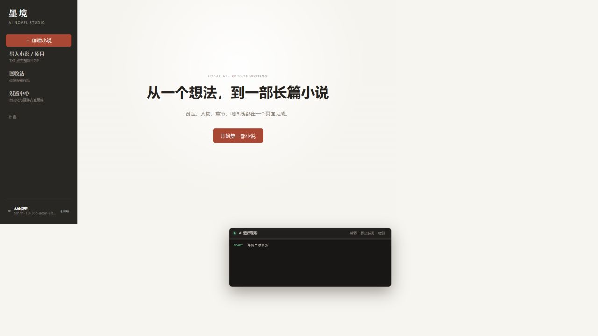
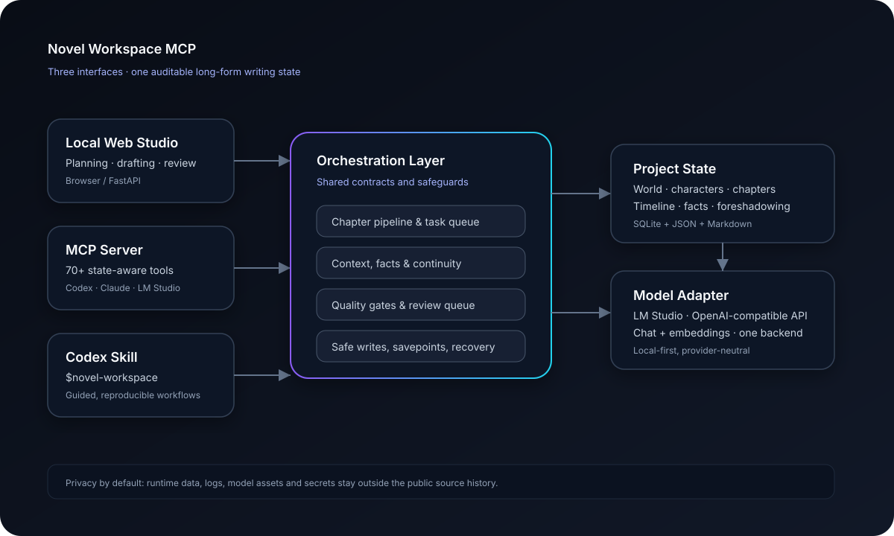

# Novel Workspace MCP

[](https://github.com/LiZh132707/novel-workspace-mcp/actions/workflows/ci.yml)
[](https://github.com/LiZh132707/novel-workspace-mcp/releases)
[](https://www.python.org/)
[](LICENSE)

**English · [中文](README.zh-CN.md) · [日本語](README.ja.md)**

> From a single idea to a complete long-form novel.

Novel Workspace MCP is a production-oriented AI writing workspace for long-form fiction. It keeps world-building, characters, chapter plans, timelines, facts, foreshadowing, context, and revisions in one auditable project state.

## Three ways to use it

1. **Local web studio** — a focused browser workspace for planning, drafting, reviewing, and exporting.
2. **MCP server** — a tool surface for LM Studio, Claude Desktop, Codex, and other MCP clients.
3. **Codex Skill** — install `skills/novel-workspace/` and invoke `$novel-workspace` for state-aware writing workflows.

## Model backends

Use a local LM Studio server by default, or connect to any OpenAI-compatible API. Set `NOVEL_LLM_PROVIDER=local` or `api` in a private `.env` file. API keys never belong in source code, screenshots, or Git history.

The web studio defaults to English. Use the Language menu in the sidebar to switch to Chinese or Japanese; the preference is stored only in your browser. Release notes are maintained in English in [`CHANGELOG.md`](CHANGELOG.md).

Source checkouts keep runtime data under the repository for portable local development. Package installations use the operating system's user data directory. Set `NOVEL_WORKSPACE_HOME` to choose an explicit location; model credentials remain in environment variables or a private `.env` file.

## What it does

- Guided novel creation: premise, world, rules, style, outline, volumes, opening plan, and characters.
- Chapter pipeline: brief → plan → draft → quality gate → summary → continuity handoff.
- Long-form continuity: facts, timeline, character arcs, foreshadowing, causal checks, canonical locks, and travel rules.
- Safe editing: working drafts, savepoints, diffs, recovery, imports, exports, and transactional history revision.
- Persistent background jobs with resumable logs and strict single-concurrency model access.

## Quick start

### Product preview





[▶ Watch the 11-second product trailer (MP4)](docs/assets/demo.mp4) · [90-second demo storyboard](docs/demo.md)

See the lightweight [demo storyboard](docs/demo.md) and the [community launch checklist](COMMUNITY.md).

```bash
uv sync
uv run novel-workspace doctor
uv run novel-workspace serve
```

Open `http://127.0.0.1:8765`. For the MCP server:

```bash
uv run novel-workspace mcp
```

See [`.env.example`](.env.example) for local/API configuration and the [Chinese README](README.zh-CN.md) for the complete tool catalog.

For Docker or one-click startup, use `docker compose up --build` or `scripts/start.ps1` / `scripts/start.sh`. Tagged releases are also published to `ghcr.io/lizh132707/novel-workspace-mcp`.

```bash
docker run --rm -p 8765:8765 \
  -e NOVEL_LLM_PROVIDER=api \
  -e NOVEL_LLM_BASE_URL=http://host.docker.internal:1234/v1 \
  -v novel_workspace_storage:/app/storage \
  ghcr.io/lizh132707/novel-workspace-mcp:latest
```

The release workflow builds wheel and source distributions and attaches them to GitHub Releases. PyPI Trusted Publishing is available as an explicit maintainer action after the PyPI project is linked to this repository.

## Development

```bash
python -m pip install -e ".[dev]"
pytest -q
```

CI validates Python 3.10 and 3.12, the CLI doctor, frontend JavaScript syntax, and the full test suite.

## Project status

The repository is intentionally data-free for public development. Runtime storage, logs, model assets, and local secrets are ignored by Git. Contributions, issue reports, and new provider adapters are welcome; see [`CONTRIBUTING.md`](CONTRIBUTING.md) and [`SECURITY.md`](SECURITY.md).

## License

MIT © LiZh132707
